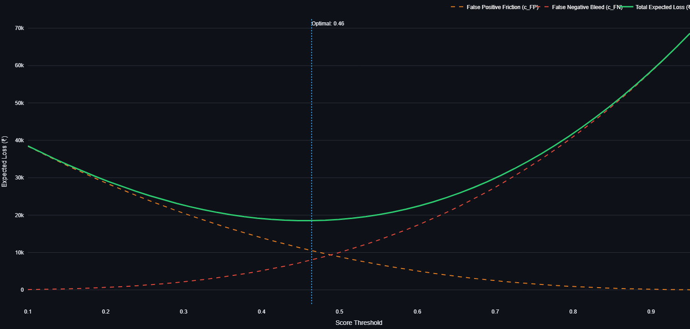
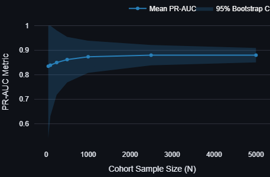

# 🛡️ RazorPulse: Ultra-Low Latency Risk Engine & Agentic Swarm

> **A production-grade, decoupled microservice stack for sub-50ms synthetic burst detection, dynamic financial thresholding, and automated T+1 incident response.**

RazorPulse shifts the paradigm of FinTech fraud detection from *temporal rate-limiting* to **spatial density clustering**, catching highly coordinated proxy networks (e.g., Scattered Spider) at exactly **T-0**.

---

## 🗺️ Implementation Phases
The architecture was developed and deployed across four strict phases to ensure modular stability:
- **Phase 1 (Ingestion):** FastAPI data pipelines and strict Pydantic temporal schema enforcement.
- **Phase 2 (Speed Layer):** Sub-50ms spatial density evaluation and in-memory ring-buffer state management.
- **Phase 3 (Swarm):** T+1 asynchronous multi-agent LLM forensics with hybrid circuit breakers.
- **Phase 4 (Observability):** Non-blocking, decoupled Streamlit command center for Risk Operations.

---

## 🧠 Core Machine Learning Fundamentals

### 1. Spatial Density Over Temporal Rules
Instead of counting failed logins per minute (which attackers bypass via IP rotation), RazorPulse evaluates the "distance" between concurrent transactions in a high-dimensional feature space. By measuring spatial density, we identify micro-clusters of synthetic behavior that rule-based ML misses.

### 2. Economic Defense vs. "Charm Pricing" Evasion
When adversaries inject bot rings that perfectly mimic ₹99 or ₹499 charm pricing, traditional anomaly scores ($\chi^2$) drop to near zero, blinding standard models. RazorPulse implements an **Economic Defense** layer. By identifying density over volume, the engine forces fraudsters to either trigger a hard block or exactly mimic slow human behavior—mathematically destroying their ROI and velocity, rendering the attack economically unviable.

---

## 🏗️ Core Software Engineering Fundamentals

RazorPulse is built with strict adherence to enterprise software design patterns.

### 1. 3-Tier Decoupled Architecture
* **Ingestion API (FastAPI):** A standalone ASGI web server that receives payloads, scores them, and manages state.
* **Traffic Simulator (`generator.py`):** An independent Python client utilizing `threading` to stream continuous baseline traffic and inject adversarial bursts.
* **Observability UI (Streamlit):** A stateless frontend that polls the backend API. It does not generate or mutate data.

### 2. High-Speed State Management
To achieve sub-50ms latency without database overhead, the FastAPI backend implements an **In-Memory Ring Buffer** (`collections.deque(maxlen=500)`). This mimics a Redis Stream, maintaining a lightning-fast moving window of the cluster state querying via `GET /v1/telemetry`.

### 3. Circuit Breakers & API Resilience
LLM APIs are prone to rate limits (HTTP 429) and server overloads (HTTP 503). RazorPulse implements a **Hybrid Resilience Layer**:
* **Model Failover:** If `gemini-3.6-flash` fails, the system automatically degrades to older, highly available models.
* **Local Deterministic Fallback:** If cloud infrastructure drops, the orchestrator trips a circuit breaker and falls back to a local, high-speed deterministic generation cache. The UI never crashes.

### 4. Temporal Data Leakage Prevention
Machine learning models are highly susceptible to temporal data leakage (e.g., future fields like `chargeback_date` infecting training data). RazorPulse utilizes strict **Pydantic Schema Enforcement** in the ingestion layer to strip and validate payloads, ensuring zero temporal leakage can infect the T-0 clustering engine.

---

## 🛑 Critical Production Edge Cases

During deployment profiling, the architecture was hardened against several critical production edge-cases:

### 1. The CGNAT Division-by-Zero Crash (Laplace Smoothing)
**Issue:** Simulating pure telecom traffic caused the clustering matrix to crash. Due to heavy reliance on CGNAT (Carrier-Grade NAT) in mobile networks, multiple devices share single IPs, causing feature math to drop to exactly zero.
**Resolution:** Engineered mathematical stability via **Laplace Smoothing** ($+1$ to counts, $+0.001$ to weights). The system mathematically cannot divide by zero or zero-out a spatial dimension, ensuring 100% uptime during traffic spikes.

### 2. Dynamic Thresholding (Cost Optimization over 0.5 Defaults)
**Issue:** Default ML decision thresholds (0.5) are inadequate for FinTech. Blocking a legitimate user (False Positive) who spends ₹15,000 annually costs drastically more than letting a bot drain a ₹500 promo (False Negative).
**Resolution:** Built an explicit financial cost equation using Razorpay-equivalent liability metrics. The system sweeps thresholds from 0.0 to 1.0, dynamically selecting the cutoff that results in the **lowest actual Rupee (₹) loss liability**.


*Figure 1: RazorPulse UI dynamically calculating the optimal decision threshold to minimize net Rupee liability.*

### 3. Variance Control in Small Data Windows
**Issue:** Initial traffic streams often lack the volume required for stable statistical metrics.
**Resolution:** Implemented **Monte Carlo scaling** (visualized in the dashboard) to bootstrap confidence intervals, accounting for statistical variance natively in production.


*Figure 2: Streamlit observability module bootstrapping confidence intervals for low-volume traffic streams.*

---

## 🤖 Risk Ops: Agentic Post-Mortems & Explainability

Risk Operations require strict explainability. Black Box AI is unsuitable for compliance. 

1. **The Exception Ledger:** Logs the exact $\chi^2$ anomaly score, spatial density metric, and financial cost confidence for every flagged cohort.
2. **The Autonomous Swarm:** When a block occurs, an async LLM pipeline executes a multi-agent post-mortem:
   - **IntelAgent:** OSINT footprinting on the blocked proxy subnet.
   - **RiskQuantAgent:** Calculates the exact financial blast radius (₹) prevented.
   - **CommsAgent:** Drafts the actionable merchant advisory incident report.

---

## ⚡ Quickstart

**Prerequisites:**
- Python 3.10+
- Google Gemini API Key (Exported to env or set in `swarm.py`)
- `pip install -r requirements.txt`

**One-Click Boot (Windows):**
Double-click `run.bat` to automatically orchestrate the Backend, Traffic Generator, and UI in isolated processes.

**Manual Boot (Mac/Linux):**
```bash
uvicorn app.main:app --reload            # Terminal 1: API Server
python synthetic/generator.py            # Terminal 2: Traffic Client
streamlit run dashboard/app.py           # Terminal 3: UI Dashboard
